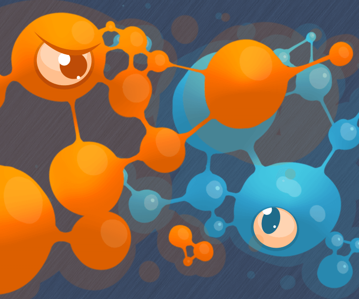

# CodinGame - Winter Challenge 2024

## Goal

Grow your organism to become the largest!

## Rules

The game is played on a grid.

For the lower leagues, you need only beat the Boss in specific situations.

### The Organisms

**Organisms** are made up of **organs** that take up _one_ tile of space on the game grid.

Each player starts with a `ROOT` type organ. In this league, your organism can `GROW` a new `BASIC` type organ on each turn in order to cover a larger area.

A new organ can grow **from** any existing **organ**, onto an **empty adjacent location**.

In order to `GROW`, your organism needs **proteins**.

In this league, you start with _10_ proteins of type `A`. Growing _1_ `BASIC` organ requires _1_ of these proteins.

You can obtain more **proteins** by growing an organ onto a tile of the grid containing a **protein source**, these are tiles with a letter in them. Doing so will grant you _3_ proteins of the corresponding type.

**Grow more organs than the Boss to advance to the next league**.

You organism can receive the following command:

- `GROW id x y type`: creates a new organ at location x, y from organ with id id. If the target location is not a neighbour of id, the organ will be created on the shortest path to x, y.

See the **Game Protocol** section for more information on sending commands to your organism.

### Game End

The game stops when it detects progress can no longer be made or after _100_ turns.

#### Victory Conditions

- The winner is the player with the most tiles occupied by one of their organs.

#### Defeat Conditions

- Your program does not provide a command in the alloted time or one of the commands is invalid.

### Debugging Tips

- Hover over the grid to see extra information on the organ under your mouse.
- Append text after any command and that text will appear above your organism.
- Press the gear icon on the viewer to access extra display options.
- Use the keyboard to control the action: space to play/pause, arrows to step 1 frame at a time.

## Game Protocol

### Initialization Input

- **First line**: two integers `width` and `height` for the size of the grid.

### Input for One Game Turn

- **First line**: one integer `entityCount` for the number of entities on the grid.
- **Next `entityCount` lines**: the following _7_ inputs for each entity:
  - `x`: X coordinate (_0_ is leftmost)
  - `y`: Y coordinate (_0_ is topmost)
  - `type`:
    - `WALL` for a wall
    - `ROOT` for a ROOT type organ
    - `BASIC` for a BASIC type organ
    - `HARVESTER` for a HARVESTER type organ
    - `A` for an A protein source
  - `owner`:
    - `1` if you are the owner of this organ
    - `0` if your opponent owns this organ
    - `-1` if this is not an organ
  - `organId`: unique id of this entity if it is an organ, `-1` otherwise
  - `organDir`: `N`, `W`, `S`, or `E`, not used in this league
  - `organParentId`: if it is an organ, the organId of the organ that this organ grew from (0 for ROOT organs), else `-1`.
  - `organRootId`: if it is an organ, the `organId` of the ROOT that this organ originally grew from, else `-1`.
- **Next line**: _4_ integers: `myA`,`myB`,`myC`,`myD` for the amount of each protein type you have.
- **Next line**: _4_ integers: `oppA`,`oppB`,`oppC`,`oppD` for the amount of each protein type your opponent has.
- **Next line**: the integer `requiredActionsCount` which equals _1_ in this league.

### Output

- A single line with your action: `GROW id x y type` : attempt to grow a new organ of type `type` at location `x`, `y` from organ with id `id`. If the target location is not a neighbour of `id`, the organ will be created on the shortest path to `x`, `y`.
